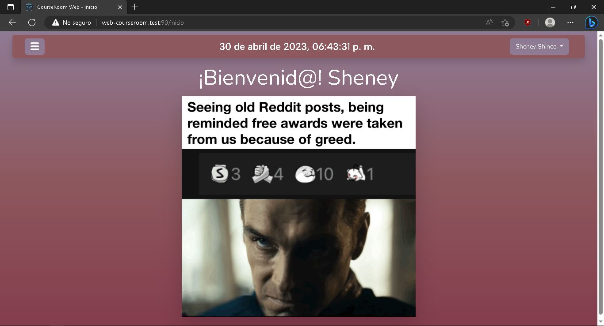
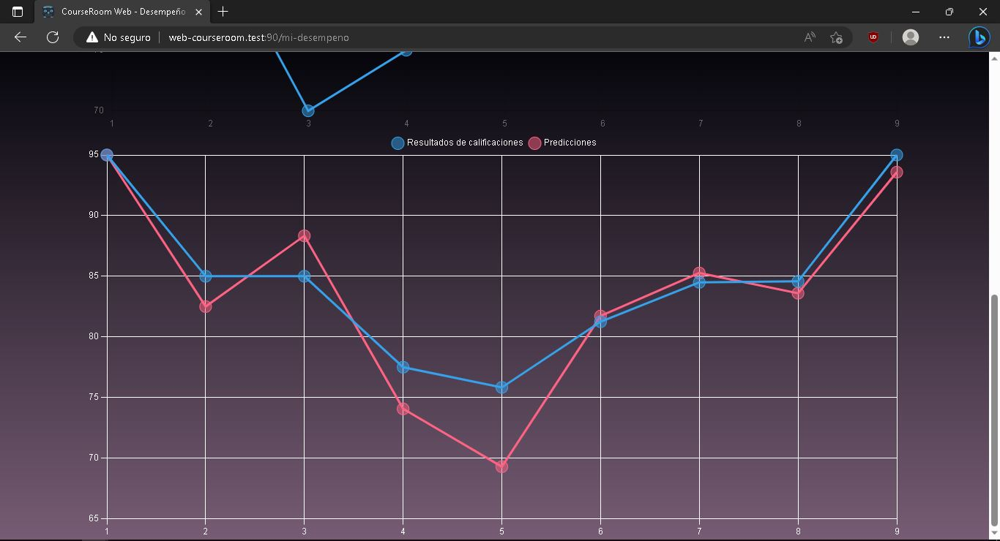
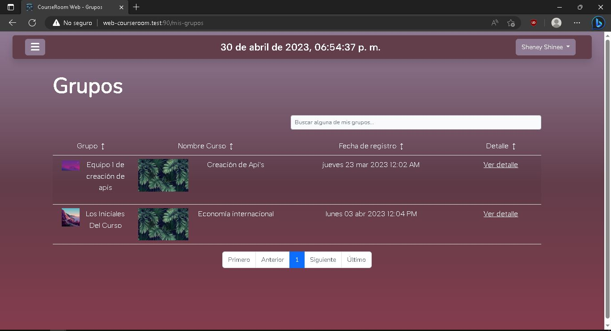
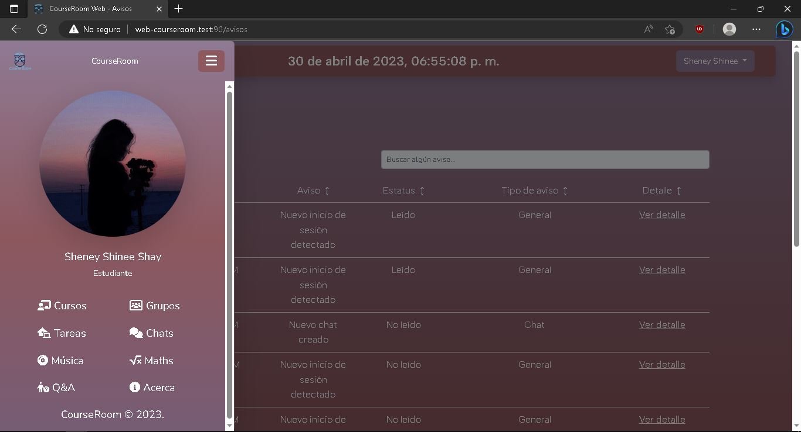
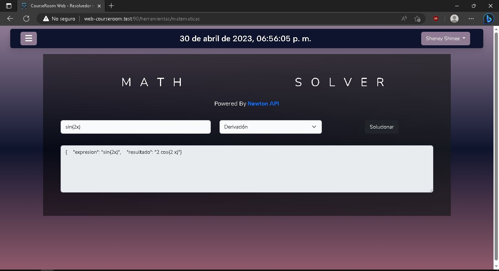
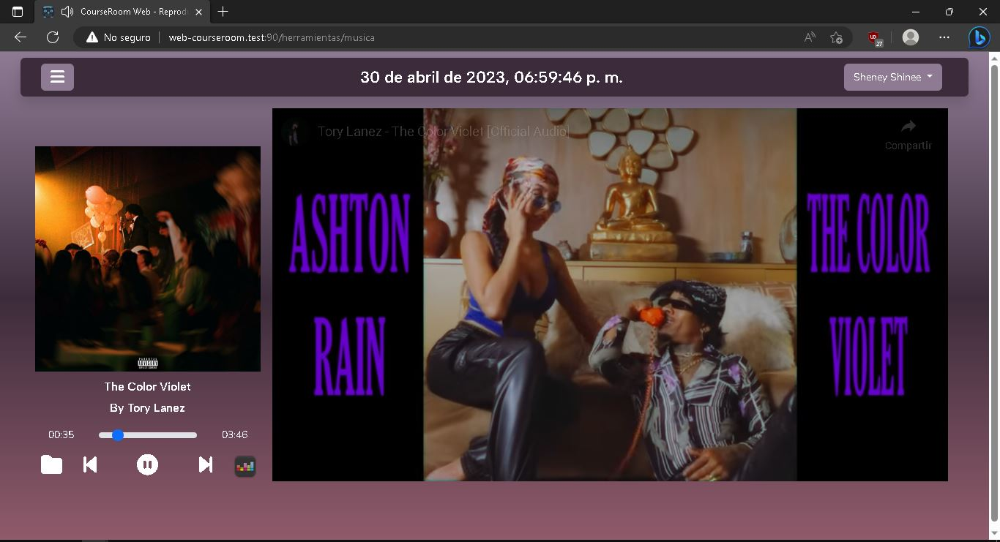
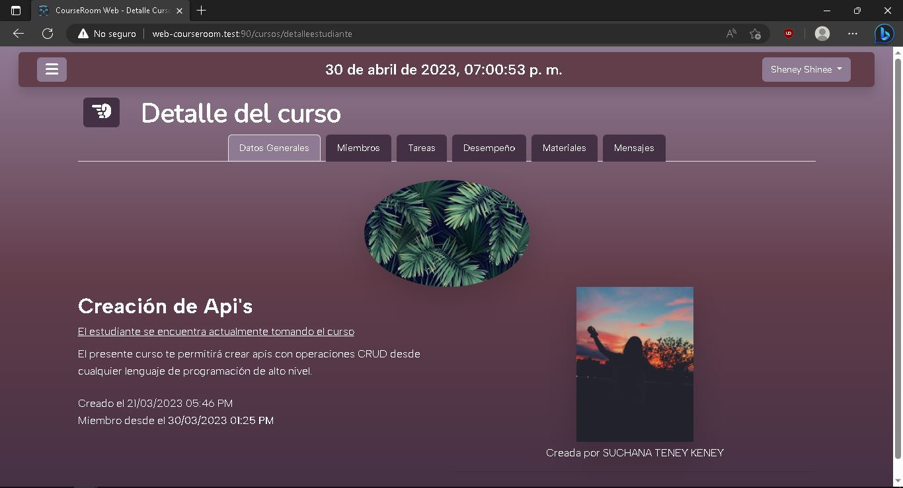
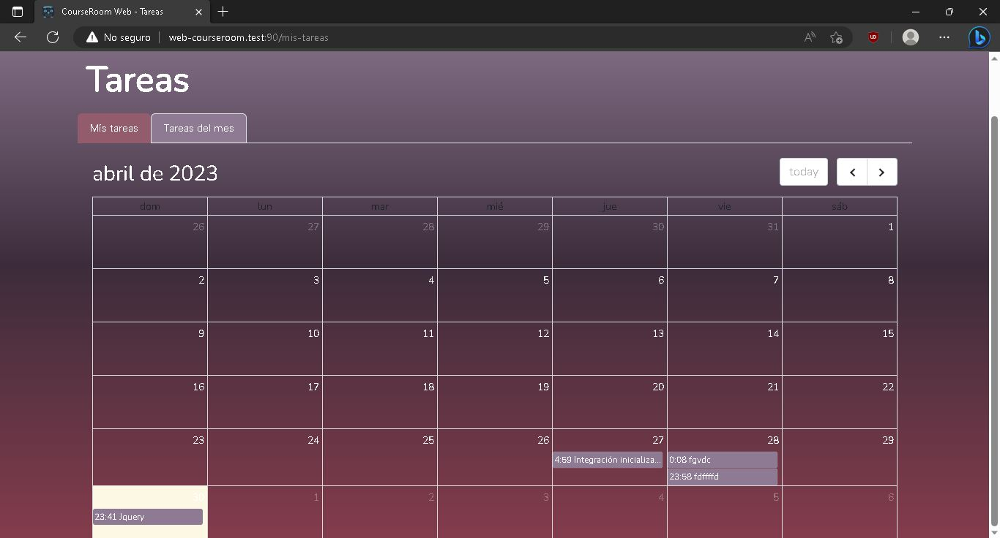

<h2 class="mb-4 display-6 primer-color-letra">Acerca de CourseRoom </h2>
<b>CourseRoom</b> consiste principalmente en un conjunto de aplicaciones desarrolladas en el lenguaje de programación Java y basadas en el modelo de diseño de software cliente-servidor. Tiene como principal objetivo organizar los procesos de un curso educativo y brindar estadísticas respectivas de este a los usuarios en general. El funcionamiento general, a grandes rasgos, consta de tres módulos principales: una aplicación para el usuario final (ya sea alumno o docente) que plantea el comportamiento general de un curso (interacción alumno-profesor, así como la gestión del aprendizaje del alumno dentro del curso), además de otras funcionalidades que le permiten al usuario visualizar contenido multimedia, ver información y estadísticas de sus cursos, conocer cursos comunes, trabajar en grupos, chatear, entre otras cosas; un programa servidor que controla las solicitudes de los clientes y genera respuestas tales como subir, editar, borrar y visualizar archivos, establecer comunicación a través de chats y realizar funciones y/o procesos específicos, entre otros; y finalmente, un conjunto de programas encargados de realizar diversas tareas específicas, como generar equipos aleatorios, enviar notificaciones a los usuarios, generar y obtener estadísticas e información relevante sobre los estudiantes y docentes dentro de los cursos, entre otras.

## Capturas

<i>CourseRoom® 2023</i>

